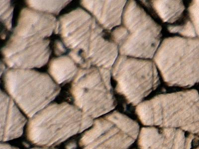
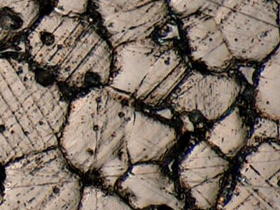
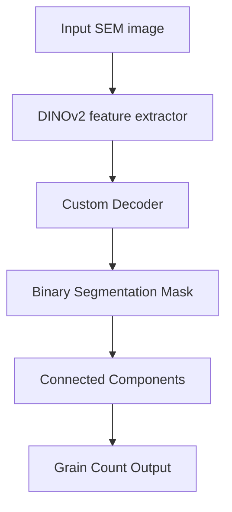

#  Grain Counting on Microscopic Images using DINOv2

This project presents an AI-powered solution for automatic segmentation and counting of grains (microstructural patterns) in microscopic images of materials. The approach is based on a Vision Transformer (ViT) backbone — **DINOv2**, which enables high-quality visual understanding with minimal manual annotation.

---

##  Problem Overview

Manual annotation and grain counting on SEM (scanning electron microscopy) images is time-consuming, error-prone and infeasible at scale. Since grains impact material properties like strength, corrosion resistance and ductility, accurate analysis is essential in domains such as:
- Metallurgy
- Materials engineering
- Geology
- Manufacturing quality control

This project aims to **automate grain segmentation and counting** using self-supervised deep learning.

---

##  Project Goals

- Segment and count grains on microscopic images with high accuracy.
- Reduce or eliminate the need for manual labeling.
- Ensure generalization across different materials and magnifications.
- Provide an end-to-end scalable solution suitable for research and industry.

---

##  System Architecture

The system follows a **two-stage modular pipeline**:

1. **Segmentation Backbone: DINOv2-small**
   - Pre-trained in a self-supervised manner on diverse datasets.
   - Used as a frozen feature extractor (ViT-based).
2. **Custom Decoder**
   - Interpolation + convolutional layers to upscale DINOv2 output and generate precise binary masks (grains vs. background).
3. **Grain Counting**
   - Post-processing with OpenCV’s `connectedComponents` to count individual grains.
   - Evaluation with pseudo ground truth and metrics.

---

##  Demo

| Input Image | Predicted Mask |
|-------------|----------------|
|  |  |
|  |  |
|  |  |

---

##  Datasets

Two datasets were used:
- **Internal dataset**: 22 high-res images (BMP), magnifications: x100, x250, x500
- **Public Kaggle dataset**: 315 labeled images (PNG), stainless steel microstructure at x500 magnification

---

## 📓 Additional Notebook: `Computer Vision Grain Segmentation.ipynb`

This notebook contains the **complete preprocessing workflow** for preparing the internal microscopic image dataset. It focuses on generating **pseudo ground truth masks** for segmentation and counting tasks. The images originally had no annotations.

### Key steps performed in the notebook:

- Loading and visual inspection of high-resolution `.bmp` images  
- Applying **CLAHE** (Contrast Limited Adaptive Histogram Equalization) to enhance local contrast  
- Smoothing with **Gaussian blur** to reduce noise  
- **Otsu thresholding** for automatic binarization  
- **Morphological operations** (closing, dilation, opening) to refine and clean the binary masks  
- Removing small connected components (noise) based on area threshold  
- Generating final **binary masks** used as pseudo labels for training and evaluation  
- Saving the masks to disk for later use in model training

### Purpose of the notebook:

- Build a reproducible pipeline for working with unlabeled, internal datasets  
- Generate consistent and usable pseudo ground truth for segmentation models  
- Serve as an explainable preprocessing baseline for future experiments

This notebook is a critical step in enabling the model to learn without manually annotated masks.

### Preprocessing Steps:
- CLAHE (contrast enhancement)
- Gaussian blur (noise removal)
- Adaptive thresholding
- Morphological operations
- Pseudo mask generation via Otsu + `connectedComponents`
- Ground truth counts derived from cleaned masks

---

##  Results & Performance

| Metric | Description | Value |
|--------|-------------|-------|
| **IoU** | Intersection over Union (segmentation quality) | **0.6746** |
| **MAE** | Mean Absolute Error (counting error) | **18.44** |
| **R² Score** | Regression fit (real vs predicted count) | **0.7605** |

The system demonstrates strong performance with minimal training data and high generalization.

---

##  Why DINOv2?

- **Self-supervised training** — doesn’t require labeled data.
- **Robust feature extraction** — generalizes well across image domains.
- **Efficient** — using the `small` version for better speed/memory.
- **Freezes backbone** — only decoder is trained → faster, simpler training.

Compared to traditional CNN or SEraMic pipelines:

- Fewer dependencies  
- Fully automated  
- Better scalability

---

## Checkpoints

In the `checkpoints` folder there is also the **finally trained model** that we used for segmentation and grain counting (based on the DINOv2 architecture).
You can directly use this model for evaluation and further experimentation.

- `checkpoints/final_segmentation_model.pth` — final model weight

---

##  Model Flow

---

## Requirements

- Python 3.10+
- PyTorch 2.0+
- OpenCV
- NumPy
- Matplotlib
- Scikit-learn
- Torchvision
- `timm` (for DINOv2 backbone)

