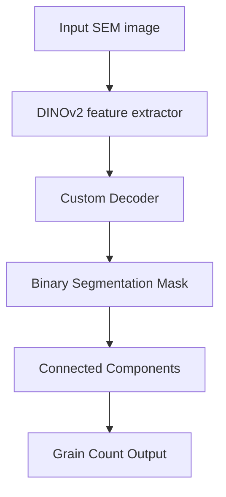

#  Grain Counting on Microscopic Images using DINOv2

This project presents an AI-powered solution for automatic segmentation and counting of grains (microstructural patterns) in microscopic images of materials. The approach is based on a Vision Transformer (ViT) backbone — **DINOv2**, which enables high-quality visual understanding with minimal manual annotation.

---

##  Problem Overview

Manual annotation and grain counting on SEM (scanning electron microscopy) images is time-consuming, error-prone and infeasible at scale. Since grains impact material properties like strength, corrosion resistance and ductility, accurate analysis is essential in domains such as:
- Metallurgy
- Materials engineering
- Geology
- Manufacturing quality control

This project aims to **automate grain segmentation and counting** using self-supervised deep learning.

---

##  Project Goals

- Segment and count grains on microscopic images with high accuracy.
- Reduce or eliminate the need for manual labeling.
- Ensure generalization across different materials and magnifications.
- Provide an end-to-end scalable solution suitable for research and industry.

---

##  System Architecture

The system follows a **two-stage modular pipeline**:

1. **Segmentation Backbone: DINOv2-small**
   - Pre-trained in a self-supervised manner on diverse datasets.
   - Used as a frozen feature extractor (ViT-based).
2. **Custom Decoder**
   - Interpolation + convolutional layers to upscale DINOv2 output and generate precise binary masks (grains vs. background).
3. **Grain Counting**
   - Post-processing with OpenCV’s `connectedComponents` to count individual grains.
   - Evaluation with pseudo ground truth and metrics.

  

---

##  Datasets

Two datasets were used:
- **Internal dataset**: 22 high-res images (BMP), magnifications: x100, x250, x500
- **Public Kaggle dataset**: 315 labeled images (PNG), stainless steel microstructure at x500 magnification

### Preprocessing Steps:
- CLAHE (contrast enhancement)
- Gaussian blur (noise removal)
- Adaptive thresholding
- Morphological operations
- Pseudo mask generation via Otsu + `connectedComponents`
- Ground truth counts derived from cleaned masks

---

##  Results & Performance

| Metric | Description | Value |
|--------|-------------|-------|
| **IoU** | Intersection over Union (segmentation quality) | **0.6746** |
| **MAE** | Mean Absolute Error (counting error) | **18.44** |
| **R² Score** | Regression fit (real vs predicted count) | **0.7605** |

The system demonstrates strong performance with minimal training data and high generalization.

---

##  Why DINOv2?

- **Self-supervised training** — doesn’t require labeled data.
- **Robust feature extraction** — generalizes well across image domains.
- **Efficient** — using the `small` version for better speed/memory.
- **Freezes backbone** — only decoder is trained → faster, simpler training.

Compared to traditional CNN or SEraMic pipelines:
 Fewer dependencies  
 Fully automated  
 Better scalability

---

##  Model Flow

---
